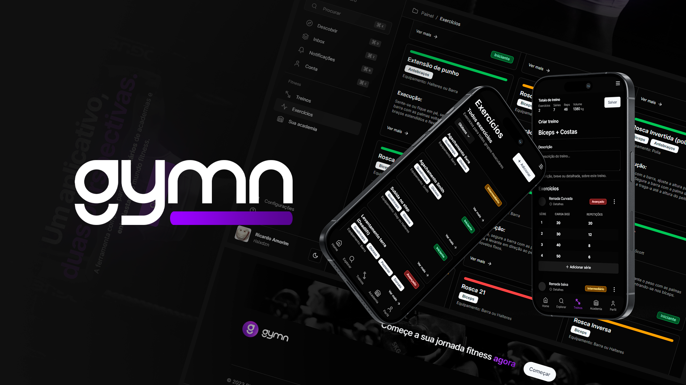

 

  <h3 align="center">Gymn</h3>

  

     One app, two perspectives. Manage your Gym, or track your personal workouts in a single place.
     
    <a href="https://github.com/othneildrew/Best-README-Template"><strong>Experience it! »</strong></a>
     
     
    ·
    <a href="https://github.com/risixdzn/gymn/issues">Report Bug</a>
    ·
    <a href="https://github.com/risixdzn/gymn/issues">Request Feature</a>
  

<!-- TABLE OF CONTENTS -->

  
Table of Contents

  <ol>
    <li>
      <a href="#about-the-project">About The Project</a>
      <ul>
        <li><a href="#built-with">Built With</a></li>
      </ul>
    </li>
    <li>
      <a href="#run-locally">Run locally</a>
    </li>
    <li><a href="#usage">Usage</a></li>
    <li><a href="#roadmap">Roadmap</a></li>
    <li><a href="#contributing">Contributing</a></li>
    <li><a href="#license">License</a></li>
    <li><a href="#contact">Contact</a></li>
    <li><a href="#acknowledgments">Acknowledgments</a></li>
  </ol>

<!-- ABOUT THE PROJECT -->

## 💪 About The Project

Gymn is a webapp made with the purpose of being used by any fitness enthusiast, ranging from a gym owner, that can manage his gym, until a gym rat, that can handle his workout routing seamlessly.

### Built With

[![Next][Next.js]][Next-url]
[![React][React.js]][React-url]
[![Supabase][Supabase]][Supabase-url]
[![Postgresql][Postgresql]][Postgresql-url]
[![Tailwind][Tailwind]][Tailwind-url]
[![Shadcn-ui][Shadcn-ui]][Shadcn-ui-url]

<!-- GETTING STARTED -->

## 💻 Run locally

As the database schema is kinda complex, having lots of relations and internal postgres scripts, you should just use the app at <a href='https://gymn.vercel.app'>https://gymn.vercel.app</a> and avoid having mental issues 🤣

## 🏋️ Usage

Gymn's purpose is to be used as a:

-   Workout tracking app
    -   Users can create and track their workout routine, creating their own workouts.
    -   They also can organize their favourite exercises.
-   Gym management app
    -   Gym owners accounts can create gyms and affiliate users
    -   The gym affiliate users have access to specific workout routines planned by their personal.
-   Gym social media
    -   All of this can be shared via posts
    -   You can have a profile and post your workout routine and inspire others to workout with you.

(<a href="#readme-top">back to top</a>)

<!-- ROADMAP -->

## 🛣️ Roadmap

-

See the [open issues](https://github.com/risixdzn/gymn/issues) for a full list of proposed features (and known issues).

(<a href="#readme-top">back to top</a>)

<!-- CONTRIBUTING -->

## Contributing

Contributions are what make the open source community such an amazing place to learn, inspire, and create. Any contributions you make are **greatly appreciated**.

If you have a suggestion that would make this better, please fork the repo and create a pull request. You can also simply open an issue with the tag "enhancement".
Don't forget to give the project a star! Thanks again!

1. Fork the Project
2. Create your Feature Branch (`git checkout -b feature/AmazingFeature`)
3. Commit your Changes (`git commit -m 'Add some AmazingFeature'`)
4. Push to the Branch (`git push origin feature/AmazingFeature`)
5. Open a Pull Request

(<a href="#readme-top">back to top</a>)

<!-- LICENSE -->

## License

Distributed under the MIT License. See `LICENSE.txt` for more information.

(<a href="#readme-top">back to top</a>)

<!-- CONTACT -->

## Contact

Your Name - [@your_twitter](https://twitter.com/your_username) - email@example.com

Project Link: [https://github.com/your_username/repo_name](https://github.com/your_username/repo_name)

(<a href="#readme-top">back to top</a>)

<!-- ACKNOWLEDGMENTS -->

## Acknowledgments

Use this space to list resources you find helpful and would like to give credit to. I've included a few of my favorites to kick things off!

-   [Choose an Open Source License](https://choosealicense.com)
-   [GitHub Emoji Cheat Sheet](https://www.webpagefx.com/tools/emoji-cheat-sheet)
-   [Malven's Flexbox Cheatsheet](https://flexbox.malven.co/)
-   [Malven's Grid Cheatsheet](https://grid.malven.co/)
-   [Img Shields](https://shields.io)
-   [GitHub Pages](https://pages.github.com)
-   [Font Awesome](https://fontawesome.com)
-   [React Icons](https://react-icons.github.io/react-icons/search)

(<a href="#readme-top">back to top</a>)

<!-- MARKDOWN LINKS & IMAGES -->
<!-- https://www.markdownguide.org/basic-syntax/#reference-style-links -->

[linkedin-shield]: https://img.shields.io/badge/-LinkedIn-black.svg?style=for-the-badge&logo=linkedin&colorB=555
[linkedin-url]: https://linkedin.com/in/othneildrew
[product-screenshot]: images/screenshot.png
[Next.js]: https://img.shields.io/badge/next.js-000000?style=for-the-badge&logo=nextdotjs&logoColor=white
[Next-url]: https://nextjs.org/
[React.js]: https://img.shields.io/badge/React-20232A?style=for-the-badge&logo=react&logoColor=61DAFB
[React-url]: https://reactjs.org/
[Supabase]: https://img.shields.io/badge/Supabase-37996B?style=for-the-badge&logo=supabase&logoColor=white
[Supabase-url]: https://supabase.com/
[Postgresql]: https://img.shields.io/badge/Postgresql-699eca?style=for-the-badge&logo=postgresql&logoColor=white
[Postgresql-url]: https://www.postgresql.org
[Tailwind]: https://img.shields.io/badge/Tailwind-0EA5E9?style=for-the-badge&logo=tailwindcss&logoColor=white
[Tailwind-url]: https://tailwindcss.com
[Shadcn-ui]: https://img.shields.io/badge/Shadcn-ui-000000?style=for-the-badge&logo=shadcnui&logoColor=white
[Shadcn-ui-url]: https://shadcn.com
